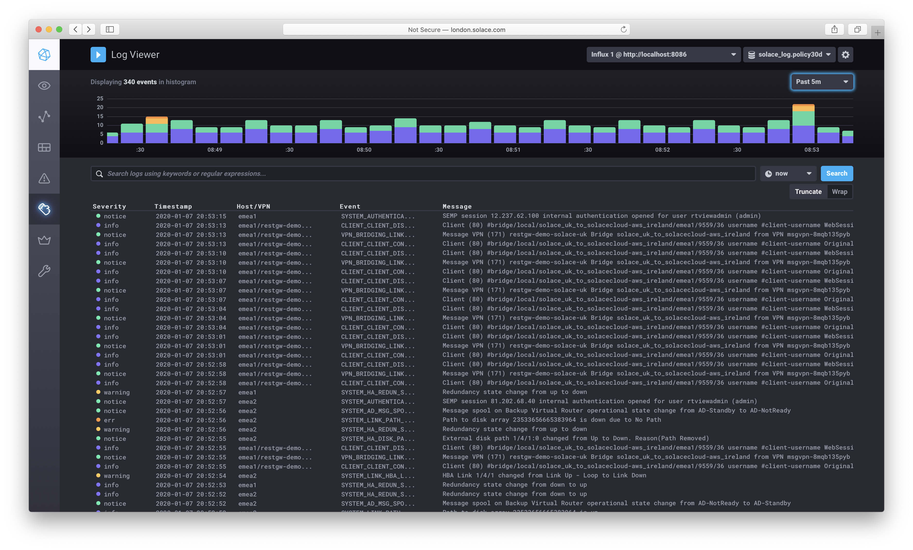
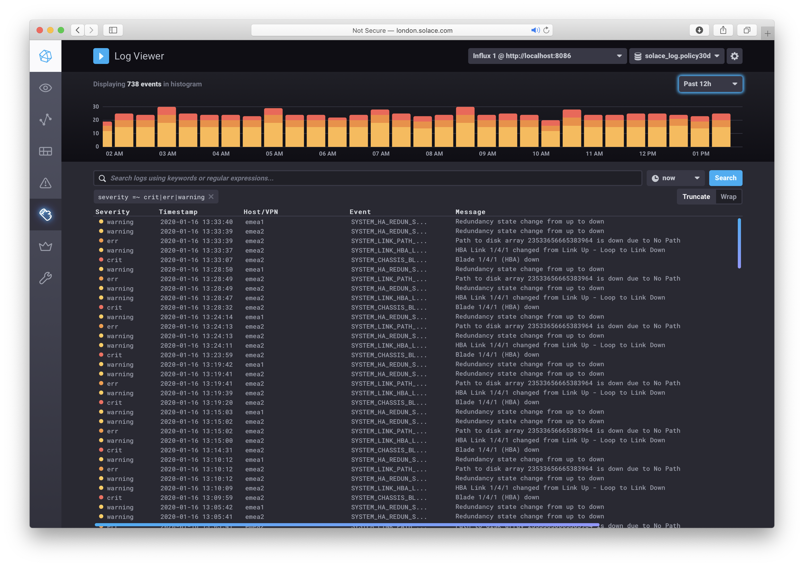
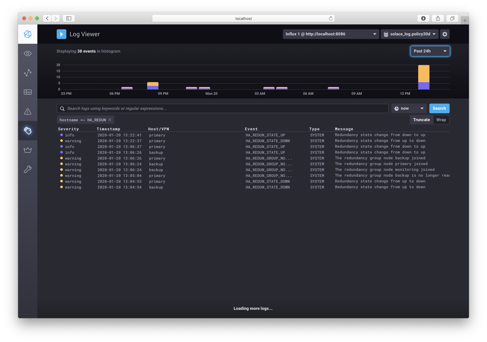
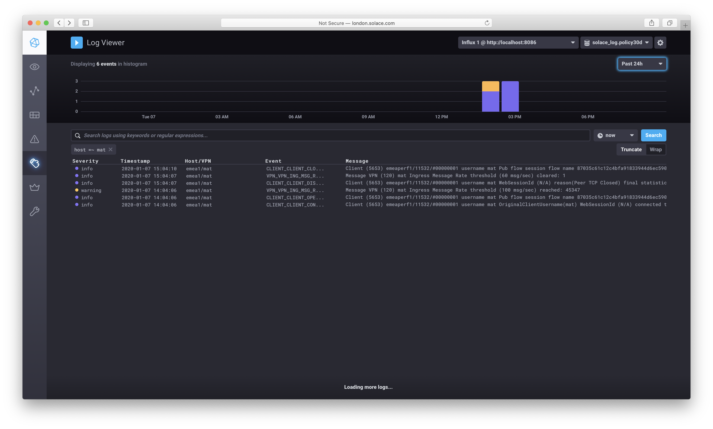
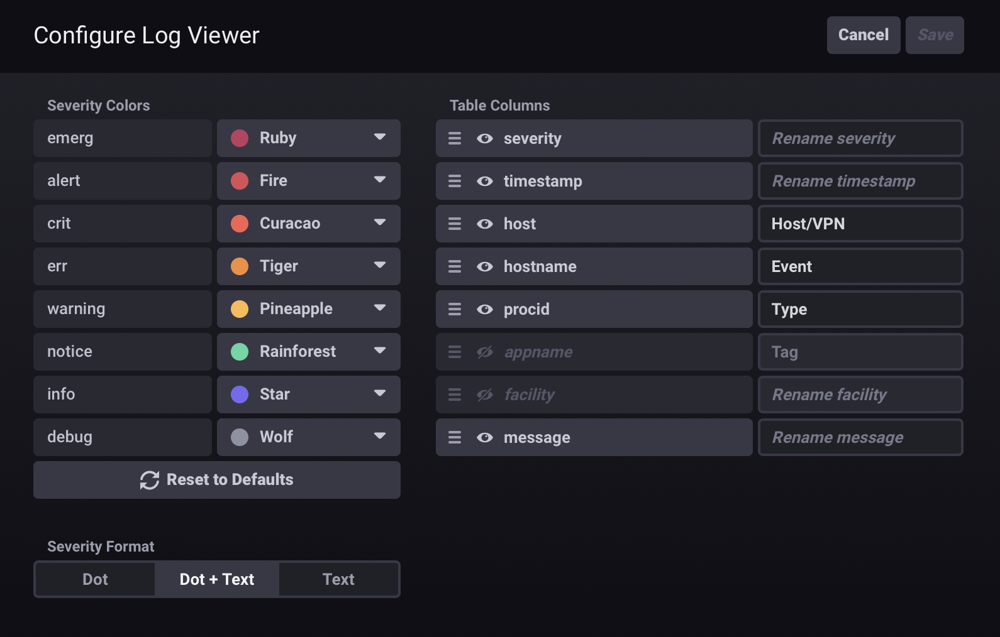

# Solace Log Collector for InfluxDB/Chronograf

This tool collects syslog messages from any solace broker and stores them in InfluxDB for visualisation with Chronograf.

The tool parses the log messages and extracts the following standard syslog information:

* Severity
* Host
* Timestamp
* Tag
* Facility
* Log Message

In addition the tool also extracts the following specific Solace broker event information:

* Event Type (SYSTEM, VPN or CLIENT)
* Event Name
* Event Tag
* VPN Name

## Live Demo 

A live demo can be viewed at: [http://london.solace.com/chronograf/logs](http://london.solace.com/chronograf/logs)

Example screenshot:



Example screenshot filtered by severity to show high severity logs only:



Example screenshot filtered by Solace Event Type to show HA_REDUN events:



Example screenshot filtered by Solace VPN:



## Setting Up InfluxDB and Chronograf

InfluxDB and Chronograf can be obtained here: [https://portal.influxdata.com/downloads](https://portal.influxdata.com/downloads)

The tool was tested with InfluxDB v1.7.9.

Logs are stored in an Influx DB measurement called "syslog" according to the
following schema (as required by the Chronograf viewer):

Tags:

* host	   - Used for host/vpn
* hostname - Used for solace event name
* appname  - Used for the solace event tag
* severity
* facility
 

Fields:

* timestamp
* message
* facility_code
* severity_code
* procid - Used for the solace event type

No specific InfluxDB configuration is required, the tool creates a database called 'solace_log' and a default retention policy for 30 days. These can be overriden on the command line, however if you wish to use a different retention policy this must have been created using the InfluxDB command line tool.
 
Chronograf has a built in log viewer that requires minimal configuration.
Configure the log viewer, for example, as shown below. Note the host column is used for host/vpn, hostname column is used for the event name, and procid column is used for the event type.



## Running The Collector

First build the source using maven, for example:

```
mvn clean dependency:copy-dependencies package
```

The collector receives syslog messages directly from the network and supports both UDP and TCP.
Note: Running with root permission may be required to bind to the default UDP port.

Example run script to listen for logs on all interfaces with both UDP and TCP on port 514 using local InlfuxDB:

```
CLASSPATH=./target/syslog-1.0.jar:./target/dependency/*
sudo java -cp $CLASSPATH  com.solace.syslog.SolaceLogCollector -username admin -password admin -dbURL http://localhost:8086 -addr 0.0.0.0 -all -tcpPort 514
```

The collector supports the following command line options:

```
	-dbURL   	<DB URL>		- Infux DB URL (default http://localhost:8086)
	-username	<Username>		- Influx DB usnername (default admin)
	-password	<Password>		- Influx DB password (default admin)
	-dbName  	<DB Name>		- Influx DB name (default solace_log)
	-rpName 	<retention policy> 	- Influx DB retention policy name (if not set creates a policy called policy30d - 30 days)
	-addr   	<interface>		- The local interface to bind to receive syslogs (default localhost)
	-udpPort 	<port>			- The UDP port to listen on for syslog messages, 0 disabes UDP (default 514)
	-tcpPort 	<port>			- The TCP port to listen on for syslog messages, 0 disabes TCP (default 0)
	-maxSev  	<max severity>		- The max severity code to process, any greater severity (ie lower importance) is ignored (default 6 - info)
	-all					- Process all syslogs collected, including non-solace events
	-debug					- Enable debug trace
```
 
## Contact

Contact: [richard.lawrence@solace.com](mailto:richard.lawrence@solace.com)


