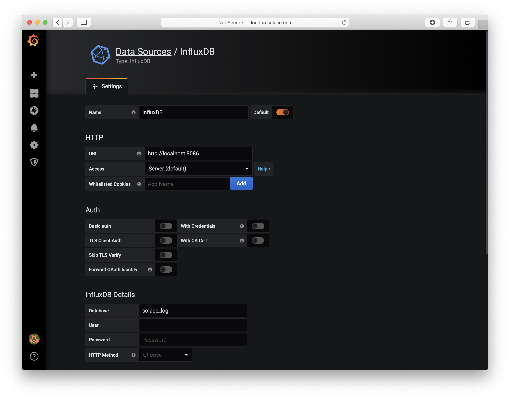

# Solace Log Collector 

This tool collects and parses syslog messages from Solace PubSub+ message brokers.
The collector receives syslog messages directly from the network and stores them in a database for visualisation.

The following databases and visualisation tools are currently supported:

* InfluxDB
* Grafana
* Chronograf

The tool parses the syslog messages and extracts the following standard log information:

* Severity
* Host
* Timestamp
* Tag
* Facility
* Log Message

In addition the tool also extracts the following specific Solace broker event information:

* Event Type (SYSTEM, VPN or CLIENT)
* Event Name
* Event Tag
* VPN Name

## Storing Logs With InfluxDB

InfluxDB can be obtained here: [https://portal.influxdata.com/downloads](https://portal.influxdata.com/downloads)

The tool was tested with InfluxDB v1.7.9.

Logs are stored in an InfluxDB measurement called "syslog" according to the following schema:

Tags:

* host
* severity
* vpn	- Solace VPN name
* eventName	- Solace event name
* eventType	- Solace event type (SYSTEM, VPN, CLIENT)

Fields:

* message
* tag	- Solace tag name


No specific InfluxDB configuration is required, the tool creates a database called 'solace_log' and a default retention policy for 30 days. These can be overridden on the command line, however if you wish to use a different retention policy this must have already been created using the InfluxDB command line tool.
 
## Viewing Logs With Grafana

A Grafana dashboard is provided for visualising logs, the view may be filtered dashboard by any combination of time, host, VPN, event type (SYSTEM, VPN, or CLIENT), event name, and severity. You may also select logs from different datasources, to support different environments such as dev, test or production for example.

Example screenshot:


If the histogram display shows an error or warning legend, for example, to see these messages filter the display by high severity as shown in the screenshot below. You can also show logs for a specifc time range using the controls at the top of the dashboard or by clicking and drag selecting a portion of the histogram chart.


Example screenshot filtered by host and Solace Event Type:


The dashboard was created using Grafana v6.6.1, to configure import the 'Solace Log Dashboard.json' file into Grafana and create a datasource for your InfluxDB installation, ensure the database is set to solace_log, as shown below. Note the number of log messages shown in the lower portion of the dashboard is limited to 1000 messages, this may be configured using the limit variable defined in the Variables section under dashboard settings.




## Running The Collector

First build the source using maven, for example:

```
mvn clean dependency:copy-dependencies package
```

Configure your Solace brokers to forward syslog messages to the host machine where you are running the collector (see [Configuring Syslog to Forward Messages](https://docs.solace.com/System-and-Software-Maintenance/Monitoring-Events-Using-Syslog.htm#montoring_and_management_1462237600_256968))

The collector receives syslog messages directly from the network and supports both UDP and TCP transports.
Note: Running with root permission may be required to bind to the default UDP port.

Example run script to listen for logs on all interfaces with both UDP and TCP on port 514 using local InlfuxDB:

```
CLASSPATH=./target/syslog-1.0.jar:./target/dependency/*
sudo java -cp $CLASSPATH  com.solace.syslog.SolaceLogCollectorInflux -username admin -password admin -dbURL http://localhost:8086 -addr 0.0.0.0 -all -tcpPort 514
```

The collector supports the following command line options:

```
	-dbURL   	<DB URL>		- Infux DB URL (default http://localhost:8086)
	-username	<Username>		- Influx DB username (default admin)
	-password	<Password>		- Influx DB password (default admin)
	-dbName  	<DB Name>		- Influx DB name (default solace_log)
	-rpName 	<retention policy> 	- Influx DB retention policy name (if not set creates a policy called policy30d - 30 days)
	-addr   	<interface>		- The local interface to bind to receive syslogs (default localhost)
	-udpPort 	<port>			- The UDP port to listen on for syslog messages, 0 disables UDP (default 514)
	-tcpPort 	<port>			- The TCP port to listen on for syslog messages, 0 disables TCP (default 0)
	-maxSev  	<max severity>		- The max severity code to process, any greater severity (ie lower importance) is ignored (default 6 - info)
	-all					- Process all syslogs collected, including non-solace events
	-debug					- Enable debug trace
```
 
## Viewing Logs With Chronograf

Chronograf has a built in log viewer that requires logs are stored in an InfluxDB measurement called "syslog" according to the
following schema:

Tags:

* host	   - Used for host/vpn
* hostname - Used for solace event name
* appname  - Used for the solace event tag
* severity
* facility
 

Fields:

* timestamp
* message
* facility_code
* severity_code
* procid - Used for the solace event type


Note; the host column is used for host/vpn, hostname column is used for the event name, and procid column is used for the event type. 
Unfortunately, it's not currently possible to change the column widths in the Chronograf display, and the host column is wider than the hostname column, which means some longer event names are truncated. If you wish to swap the columns to give more room for the event name (but less for the Host/VPN) run the collector using the -swapHostCols option.

The Chronograf viewer requires minimal configuration, example setup shown below. 


Example screenshot:


Example screenshot filtered by severity to show high severity logs only:


Example screenshot filtered by Solace Event Type to show HA_REDUN events:


Example screenshot filtered by Solace VPN:


To run the collector for viewing logs with Chronograf run the specific Chronograf subclass as below:

```
CLASSPATH=./target/syslog-1.0.jar:./target/dependency/*
sudo java -cp $CLASSPATH  com.solace.syslog.SolaceLogCollectorChronograf -username admin -password admin -dbURL http://localhost:8086 -addr 0.0.0.0 -all -tcpPort 514
```

The Chronograf collector supports the additional command line options:

```
	-swapHostCols				- Swap Host and Hostname columns (use Hostname for Host/VPN, Host for Event Type)
```

## Contact

Contact: [richard.lawrence@solace.com](mailto:richard.lawrence@solace.com)

